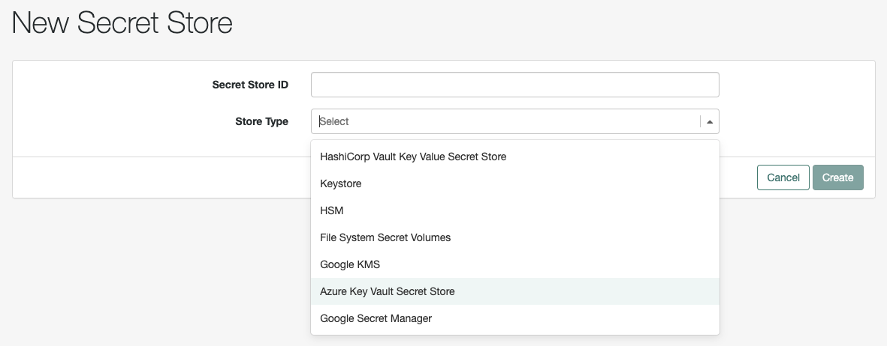
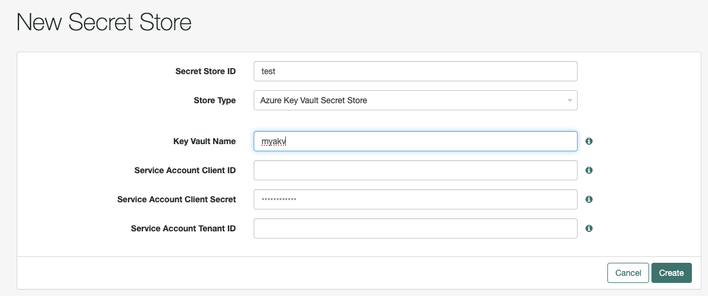
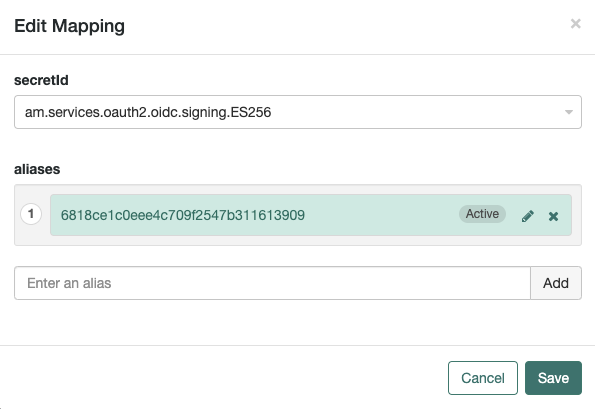

# Azure Key Vault Secret Store

A secret store plugin for AM (tested on 7.5) to retrieve secrets from Azure Key Vault at run-time.

## Prerequisites

The AKV AM secret store plugin requires an implementation of the commons-secrets backend for AKV (link to be posted)

## Notes on AKV secrets

AKV hosts 3 kinds of secrets:
* Keys - not exportable.  Only used for API-based cryptographic functions
* Secrets - Used for passwords or HMAC keys (ie Generic Secrets)
* Certificates - Used for keys and/or certificates (SSL, Signing, Verification, etc)

The backend plugin uses Azure Java SDK: https://azure.github.io/azure-sdk-for-java/keyvault.html

The plugin can use the "DefaultAzureCredential" class for authenticated which is a "passwordless" authentication method.
https://learn.microsoft.com/en-us/java/api/com.azure.identity.defaultazurecredential?view=azure-java-stable
This will inherit the loggin session from the environment, vm service account, Azure CLI, etc

If provided credentials, it can also use the "ClientSecretCredential" class for authentication:
https://learn.microsoft.com/en-us/java/api/com.azure.identity.clientsecretcredential?view=azure-java-stable
Currenltly these credentials will be stored in AM's configuration (ecrypted with AM encryption).  In future, the client secret could be referenced from another secret store using a secret label (similar to Google Secret Manager plugin)

## Configuring AKV Secret Store in ForgeRock

The first step is to install this plugin into the environment that ForgeRock Access Management is installed in. The plugin can be downloaded from the current releases here. Copy the jar file into the ./webapps/openam/WEB-INF/lib directory where ForgeRock Access Management is deployed. Restart the web container to pick up the new secret store.

The next step is to configure the secret store. AKV Secret Stores can be configured at a global and realm level:
* To create on a global level: Go to Configure > Secret Stores.
* To create on a realm level: Go to Realms > Realm Name > Secret Stores.
* Select Add Secret Store.
* Enter the Secret Store ID.
* From the Store Type drop-down list, select Azure Key Vault Secret Store.
* Enter the Key Vault Name.
   
* OPTIONAL - enter a service account Client ID/Secret/Tenant (if not specified, the plugin will use the default credentials given to the vm/environment/process/workload - RECOMMENDED)
* Select Create.
   

Create secrets and/or certificates for AM to use in AKV.  Note that secret names in AKV can not have ".", so a secret label in AM will have "." changed to "-" on the AKV side.
   

The next step is to create a mapping for the secret. Several AM features require the use of secrets for signing and encryption. For each requirement, AM has a secret ID. To provide AM with the required secret, map one or more aliases from the secret stores you configure to each of the secret IDs. These mappings allow you to choose which are the active aliases, and rotate them when they become expired or compromised.  The alias for this plugin refers to the "version" string of the secret in AKV.

To map alias in AKV Secret Store:
* To map secrets within a global secret store: Navigate to Configure > Secret Stores.
* To map secrets within a realm secret store: Navigate to Realms > Realm Name > Secret Stores.
* Select the store that contains the secrets you want to map.
* On the Mappings tab, select Add Mapping.
* From the Secret ID drop-down list, select the Secret ID that is to be associated with an alias.
* For information about the different secret ID mappings, see "Secret ID Default Mappings".
* Enter any Alias and click the add (+) icon. You can add as many aliases as necessary. The first alias in the list determines which alias (version) is the active one. Active secrets are used for signature generation and encryption, while the non-active secrets are used for signature verification and decryption.
  
* Drag and drop to change the order of alias
* Once your mappings are complete, select Create.

ForgeRock Access Management will now use this configured secret store to retrieve the mapped secrets from AKV.
